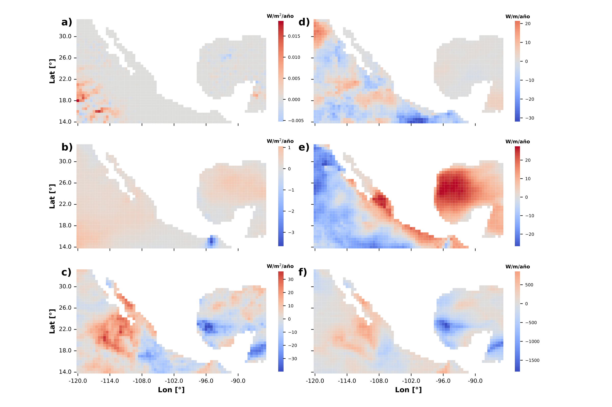
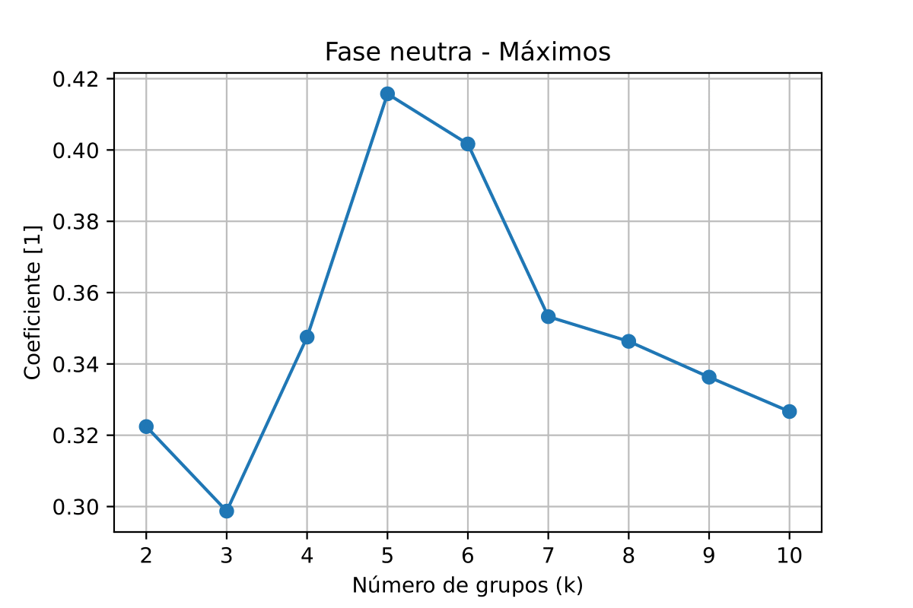
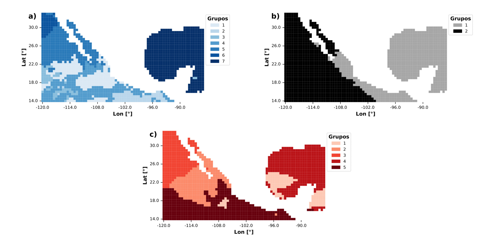

# Variabilidad espacio-temporal en datos climáticos

Este proyecto fue desarrollado para **gestionar, analizar y visualizar** el comportamiento de un conjunto de datos **espacio-temporales** del clima marítimo en la zona que rodea a México.  
El análisis considera eventos del fenómeno El Niño–Oscilación del Sur (ENOS) y se divide en **tres etapas**: filtración de datos, análisis de variación temporal y agrupación espacial (*clustering*).

---
## Estructura del repositorio
```
data-analysis/
├── 01_data_filtering/          # Filtración de datos
├── 02_temporal_variation/      # Variación temporal
└── 03_spatial_clustering/      # Agrupación espacial
```

Cada carpeta contiene:
- `code/`  → scripts con repositorios de funciones y archivos ejecutables
- `output-examples/` → ejemplos de archivos de salida

Y de requerirlo:
- `input-examples/` → ejemplos de archivos de entrada

---
## 1. Filtración de datos
**Objetivo:**  
Reducir una base de datos netCDF anual (1940–2022) calculando estadísticos representativos (mínimo, mediana y máximo) según periodos y coordenadas definidos por el usuario.

**Archivos de entrada:**
```
periods.txt
coordinates.txt
```

**Archivos de salida (ejemplo):**
- `Neutro_1950_Otono.txt`
- `Neutro_1985_Otono.txt`
- `Neutro_2019_Otono.txt`

---
## 2. Variación temporal
**Objetivo:**  
Calcular la **pendiente de cambio** (ajuste lineal) de cada parámetro a lo largo del tiempo, separando por evento ENOS y estadístico.

Eventos:
- `event-1` → Fase Neutra
- `event-2` → La Niña
- `event-3` → El Niño

Estadísticos:
- `statistic-1` → Mínimo
- `statistic-2` → Mediana
- `statistic-3` → Máximo

**Ejemplos gráficos:**


---
## 3. Agrupación espacial (*clustering*)
**Objetivo:**  
Identificar regiones espaciales con comportamientos similares en la variación temporal mediante el algoritmo **K-means**.

**Pasos clave:**
- Determinación del número óptimo de grupos → *coeficiente de silueta* y *Davies–Bouldin index*.
- Asignación de grupos a cada coordenada.
- Cálculo de características generales por grupo.
- Visualización espacial de agrupaciones.

**Ejemplos gráficos:**


